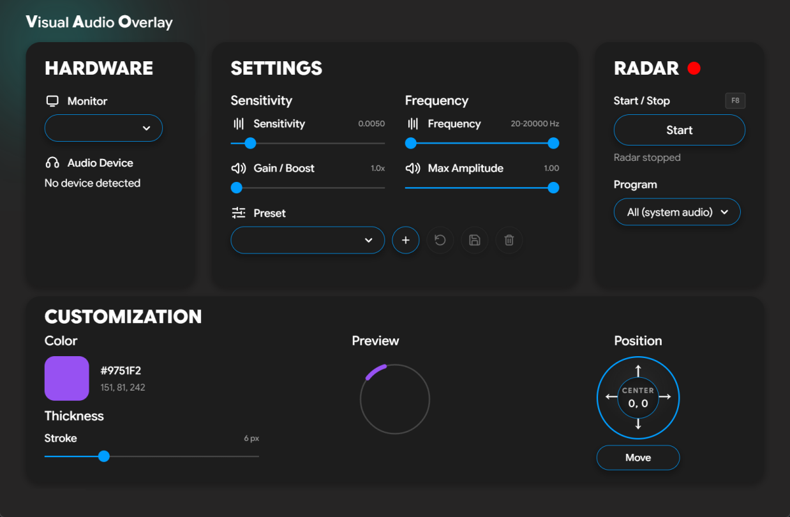

<h1 align="center">Visual Audio Overlay</h1>

<p align="center">
  <b>See what you can't hear.</b><br>
  An accessibility overlay that turns in-game sound into a real-time visual radar,
  built for gamers with single-sided deafness (SSD) or hearing loss.
</p>

<p align="center">
  
  
  
  
  
</p>

<p align="center">
  
</p>

---

## What it is

Visual Audio Overlay listens to your PC's audio and draws a sleek, transparent,
Fortnite-style circular radar on top of your game. When a sound happens, an arc
lights up in the direction it came from, so you can *see* footsteps, gunshots,
reloads, and ability cues the instant they play.

It runs as a two-part app: a control panel you keep on a second monitor, and the
radar overlay that floats over your game on your main screen.

## Who it's for

- Players with **single-sided deafness** or **hearing loss** who lose directional audio.
- Anyone gaming with one earbud in, or in a quiet household, who still wants positional awareness.
- Competitive players who want footsteps and other key cues filtered out from background noise.

## Features

- **Directional radar overlay.** Transparent, always-on-top, click-through. Arcs
  fade in and out in the direction of each sound.
- **Per-application capture.** Pick a single program (your game) so other apps
  like Discord voice chat are ignored. Uses the Windows WASAPI process-loopback
  API; pick **All (system audio)** to capture everything as before.
- **Game-specific presets.** Built-in frequency band-pass filters (CS2, Valorant,
  Fortnite, and more) isolate footsteps and ignore useless low-end rumble.
- **Single-sided listener friendly.** Turn on Windows *mono audio* and pick your
  game under **Program**: per-app capture reads each app before Windows sums the
  channels, so your working ear hears everything while the overlay keeps true
  left/right direction.
- **Smart audio boost.** Amplifies quiet, distant sounds so faint cues still register.
- **Stereo and surround.** 5.1 / 7.1 headsets unlock 360 degree front/back
  detection; stereo headsets run in left/right mode automatically.
- **Saveable presets.** Store a full per-game setup - sensitivities, filters, the
  captured program, monitor, and radar look - and switch in one click.
- **Full customization.** Pick the radar's accent color and line thickness, with a
  live preview that matches exactly what shows up in game.
- **Non-intrusive by design.** It does not inject into game memory or modify any game
  files. It simply reads the standard Windows audio output (WASAPI loopback).

## How it works

The app captures your system's audio output (the same signal going to your
headphones) and analyzes the balance between channels to estimate the direction
of each sound. That direction is drawn as an arc on the radar. Because it only
reads audio you are already playing, there is no interaction with the game itself.

> **Note on detection range:** front/back separation depends on your headset. A
> true 5.1 / 7.1 device enables full 360 degree detection. A stereo device
> can only resolve left vs. right.

## Quick start

1. Launch the app and pick your **Monitor** (where the radar appears).
2. Choose a **Preset** that matches your game, or tune Sensitivity, Gain, and the
   Frequency range yourself.
3. Set your radar **Color** and **Thickness** in Customization.
4. (Optional) In the Radar panel, pick a **Program** to capture only that game's
   audio. Leave it on **All (system audio)** to capture everything. The program
   must already be playing sound to appear in the list.
5. Hit **Start** in the Radar panel. The overlay appears on your selected monitor.

The dashboard can be minimized to the tray while the radar continues running.

## Mono output (single-sided listeners)

Enable Windows **mono audio** (**Settings > Accessibility > Audio**) so every
sound reaches your working ear, then capture your game under **Program**.

Per-app capture reads each program *before* Windows sums the channels, so you
hear a mono mix while the radar keeps true left/right direction. **All (system
audio)** reads the already-summed mix, so with Windows mono audio on it can only
point straight ahead.

> Requires Windows 11 for Program capture. On Windows 10, leave Windows mono
> audio off while the radar is running.

## Known issues

**Bluetooth A2DP headsets:** at low (but non-zero) volume, the radar loses direction.
Raise the volume or use Program capture / a wired connection.

## Getting started (from source)

```bash
git clone https://github.com/ErtisT127/VisualAudioOverlay.git
cd VisualAudioOverlay
uv sync --group dev --group build   # dev = ruff + pytest, build = nuitka
bash scripts/build_native.sh        # overlay_native.dll via MinGW
uv run python src/main.py
```

The dashboard is plain browser JavaScript with no bundling, so `pnpm install`
is only needed when working on its lint tooling.

### One-file executable

```bash
./scripts/build_nuitka.sh            # MSVC backend; --zig fallback when no Visual Studio
```

### Local quality gate

```bash
./scripts/check.sh
```

Runs the full ruff set + pytest, prettier + eslint + node tests, and the
complete clang-tidy set against the local compile database.

## License

This repository is a fork of [Mike Zaugg's VisualAudioOverlay](https://github.com/mike-s-zaugg/VisualAudioOverlay).

Copyright (c) 2026 Mike Zaugg.

This project is **source-available**, not open source. It is licensed under the
**Functional Source License, Version 1.1, MIT Future License (FSL-1.1-MIT)**. In
short: you are free to use, modify, and contribute to the code for any purpose
except building a competing product. Each release automatically becomes available
under the permissive MIT license two years after it ships.

See the [LICENSE](LICENSE) for the full terms.
